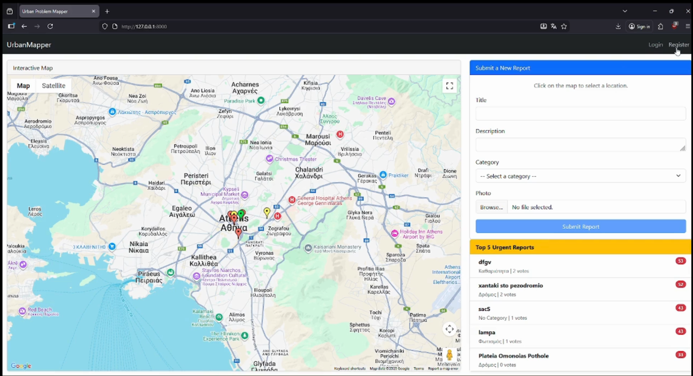
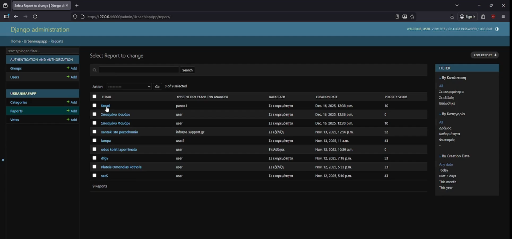

# 🗺️ UrbanMapper

A Django-based web application for reporting and prioritizing urban infrastructure issues using an interactive map interface.

Users can report problems such as damaged roads, vandalism, and infrastructure issues by selecting locations on a map, uploading photos, and providing descriptions. Reports can be voted on by the community to prioritize the most important problems requiring immediate attention.

---

## ✨ Features

### 👤 User Functionality
* **Authentication:** Secure user registration, login, and logout.
* **Issue Reporting:** Submit urban issue reports with descriptions.
* **Interactive Map:** Select report locations easily using Google Maps.
* **Media Upload:** Upload images to document the reported issues.
* **Community Voting:** Vote or unvote on existing reports to influence priority.
* **Prioritized Feed:** View prioritized problems based on community votes and age.

### 🛡️ Administration
* **Django Admin Dashboard:** Full control over the application.
* **User Management:** Manage user accounts and permissions.
* **Category Management:** Create and manage report categories.
* **Status Updates:** Update report status (`Pending` ➡️ `In Progress` ➡️ `Resolved`).
* **Moderation:** Manage submitted reports and community votes.

### 🔒 Security Features
The application implements several robust security mechanisms:
* Django authentication framework.
* Password validation and secure password storage.
* Session-based authentication & CSRF protection.
* Role-based access control for administrative functions.
* Database constraints preventing duplicate votes.
* Secure handling of user-uploaded content.

---

## 🛠️ Technology Stack

* **Backend:** Python, Django 4.2
* **Database:** SQLite
* **Frontend:** HTML/CSS, JavaScript, Bootstrap
* **Maps Integration:** Google Maps JavaScript API

---

## 📸 Screenshots

### Main Interface


### Map Report Popup


### Admin Panel


## 🏗️ Architecture

The project follows Django's Model-View-Template (MVT) architecture. 

**Main Directory Structure:**
```text
UrbanMapper
│
├── UrbanMapApp/
│   ├── models.py
│   ├── views.py
│   ├── urls.py
│   ├── admin.py
│   └── templates/
│
├── UrbanMapper/
│   ├── settings.py
│   └── urls.py
│
└── manage.py
